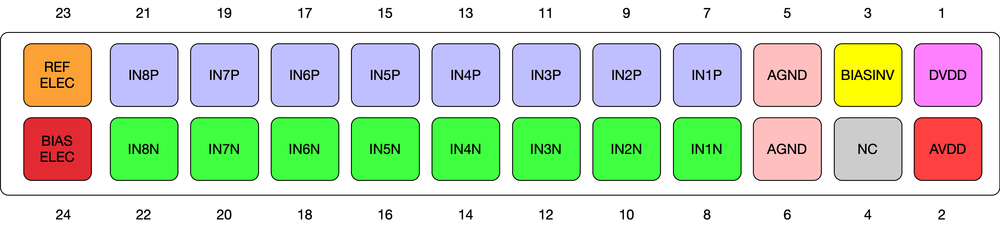

# HackEEG Connector Pinouts

## Electrode Connector

**JP16** is the electrode connector.

### Electrode connector pinout:

|Pin #	|Function						|
|-----	|-------------------------	|
|  1	|`DVDD`						|
|  2	|`AVDD`						|
|  3	|`BIASINV`					|
|  4	| Reserved for Future Use	|
|  5	|`AGND`						|
|  6	|`AGND`						|
|  7	|`IN1P`						|
|  8	|`IN1N`						|
|  9	|`IN2P`						|
| 10	|`IN2N`						|
| 11	|`IN3P`						|
| 12	|`IN3N`						|
| 13	|`IN4P`						|
| 14	|`IN4N`						|
| 15	|`IN5P`						|
| 16	|`IN5N`						|
| 17	|`IN6P`						|
| 18	|`IN6N`						|
| 19	|`IN7P`						|
| 20	|`IN7N`						|
| 21	|`IN8P`						|
| 22	|`IN8N`						|
| 23	|`REF_ELEC_CONN`				|
| 24	|`BIAS_ELEC_CONN`			|

Looking at the pins edge on (not from above), this is the pinout diagram:

## External Sync connector

This connector is experimental, and not supported at this time. You can enable it using the various ADS1299 register settings.

### External Sync connector pinout

|Pin #	|Function			|
|-----	|---------------	|
| 1   	|`BIASINV`		|
| 2   	|`ADS_START`   	|
| 3  	|`ADS_SPI_CLK`	|
| 4  	|`AGND`   		|

## Checking the connector pinouts against the schematic

If you want to check the pinout, you can see the connectors on the schematic on sheet 2:

[HackEEG Shield schematic](https://github.com/adamfeuer/hackeeg-shield/blob/master/hackeeg-shield.pdf)

## Making cables

### Electrode Connector cables

**JP16** is the large, black male 24-pin shrouded electrode connector that is soldered on the board: [On Shore Technology 24-pin right angle male shrouded header](https://www.digikey.com/product-detail/en/on-shore-technology-inc/101-246/ED10537-ND)

This the mating female connector that I use to construct ribbon cables to connect the connector boards with the HackEEG shield:

[On Shore Technologies 	101-246 IDC socket connector for ribbon cable](https://www.digikey.com/product-detail/en/on-shore-technology-inc/101-246/ED10504-ND)

Here's the ribbon cable I used:

[24-conductor ribbon cable, 5 foot length](https://www.digikey.com/product-detail/en/3m/3365-24-300SF/MC24G-5-ND/)

You'll need a tool to crimp them, I used this one from Amazon:

[IDC crimp tool](https://www.amazon.com/gp/product/B007R2JEM4)

Alternatively, any 24-pin female header with receptacles on 0.1" centers should work if you want to use one and solder some wires to it.

### External Sync Connector cables

**JP15** is the small, white male 4-pin shrouded connector that is used for synchronizing the ADS1299 with another board.

This is the connector that is soldered on the board: [JST 4-pin Shrouded Male Header ](http://www.digikey.com/product-detail/en/S4B-PH-K-S(LF)(SN)/455-1721-ND/926628)

Here is the [Mating JST connector](http://www.digikey.com/product-detail/en/PHR-4/455-1164-ND/608606) and [Crimp Contact that fits the housing](http://www.digikey.com/product-detail/en/SPH-004T-P0.5S/455-1318-1-ND/608807) - these can be crimped with this tool:

[HT-225D Full Cycle Ratchet Crimping Tool with interchangeable die set HT-225D](http://www.amazon.com/dp/B007JLN93S)

